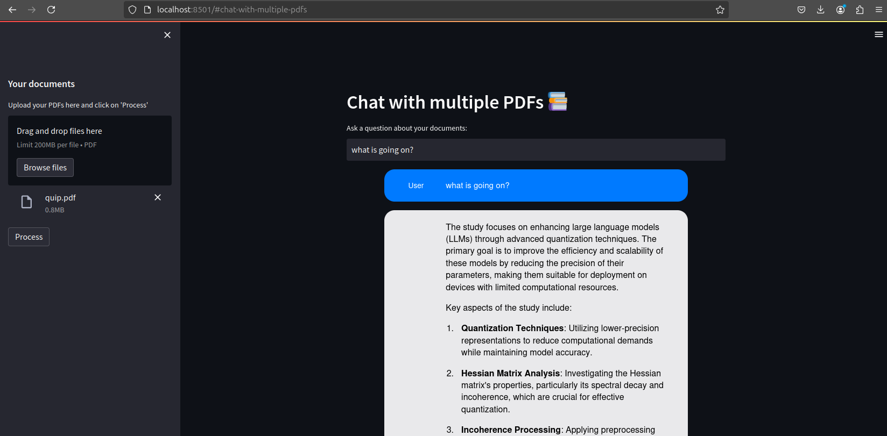

# PDF Chat Application with DeepSeek LLM

<p align="center">
  
</p>


A Streamlit-based application that allows users to chat with multiple PDF documents using the DeepSeek language model through Ollama. The application uses LangChain for document processing and FAISS for efficient vector similarity search.

## System Requirements

The application was tested on the following system specifications:
- OS: ubuntu 24.04
- Python: 3.9
- RAM: 16GB (recommended)
- GPU: NVIDIA GeForce RTX 2080 super MaxQ

## Prerequisites

1. Install Ollama:
```bash
curl -fsSL https://ollama.com/install.sh | sh
```
2.In a separate terminal run the following command
```bash
ollama serve
```

3. Pull and run the DeepSeek model:
```bash
ollama run deepseek-r1:14b
```

Note: The DeepSeek model requires approximately 14GB of RAM to run efficiently.

## Installation

1. Clone the repository:
```bash
git clone https://github.com/yashwardhanchaudhuri/chat-seek-pdf.git
cd chat-seek-pdf
```

2. Create and activate a Python virtual environment:
```bash
python -m venv venv
source venv/bin/activate 
```

3. Install the required dependencies:
```bash
pip install -r requirements.txt
```

## Configuration

 The application is pre-configured to use the local Ollama deployment with the following settings in `CustomLLM.py`:
   - Model: deepseek-r1:14b
   - Base URL: http://localhost:11434/v1
   - API Key: ollama
   - Temperature: 0.6

## Usage

1. Start the Streamlit application:
```bash
streamlit run app.py
```

2. Access the application in your web browser (typically at http://localhost:8501)

3. Using the application:
   - Upload one or more PDF documents using the sidebar
   - Click the "Process" button to analyze the documents
   - Type your questions in the input field
   - The application will provide responses based on the content of your PDFs

## Features

- Multi-PDF document support
- Interactive chat interface
- Document chunking and semantic search
- Conversation memory
- Local LLM integration through Ollama
- Efficient vector storage using FAISS

## Architecture

The application consists of several key components:
- `app.py`: Main Streamlit application
- `CustomLLM.py`: Custom LangChain LLM implementation for DeepSeek
- `htmlTemplates.py`: HTML templates for the chat interface
- FAISS vector store for efficient document retrieval
- LangChain for document processing and conversation management

## Troubleshooting

1. If Ollama is not responding:
   - Ensure Ollama is running: `ollama list`
   - Check if the model is properly loaded: `ollama run deepseek-r1:14b`

2. If you encounter memory issues:
   - Close other memory-intensive applications
   - Reduce the chunk size in `get_text_chunks()` function
   - Process smaller PDF files

## License

[MIT License]

## Contributing
Code is open source and massively inspired by https://github.com/alejandro-ao/ask-multiple-pdfs.git

